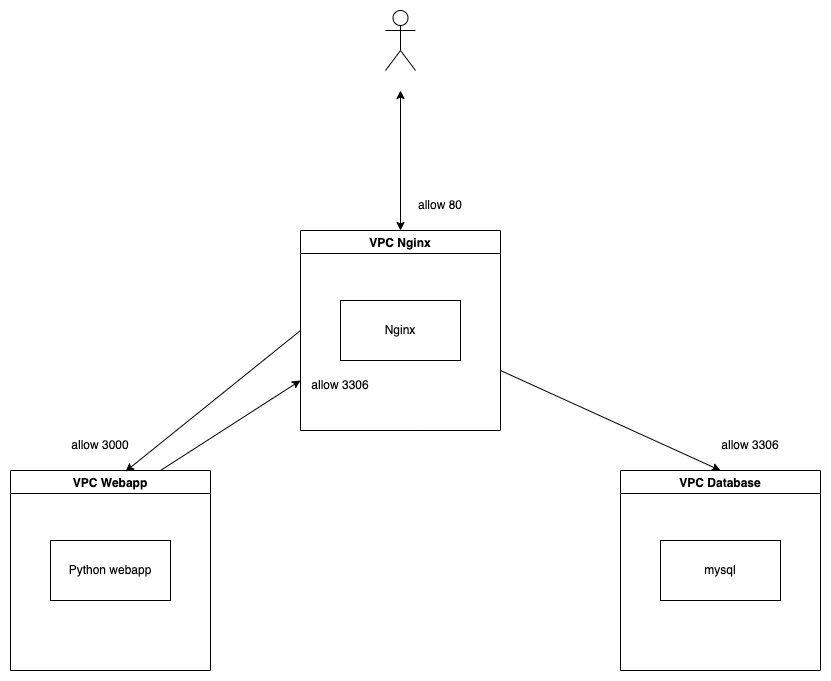
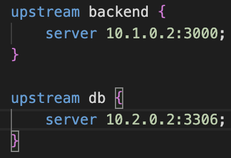
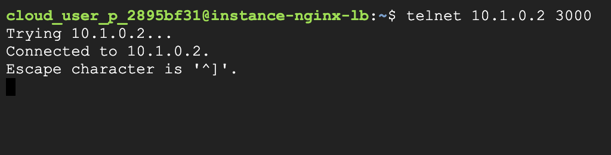
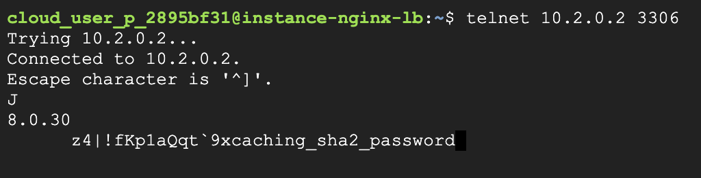
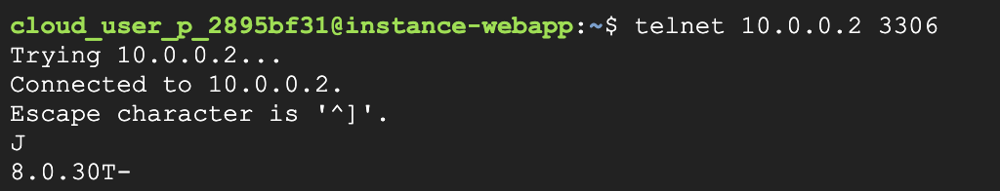
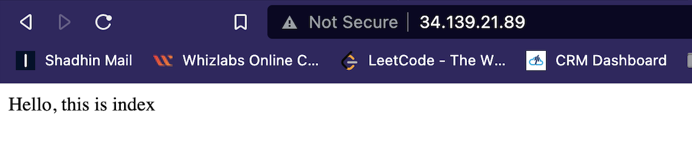
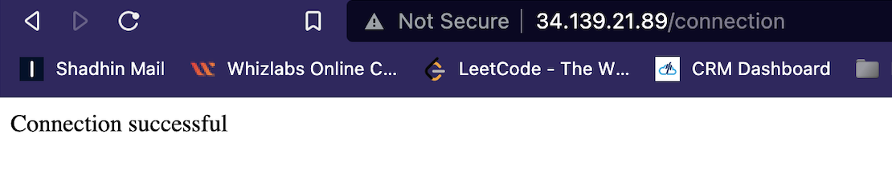

# VPC peering and nginx proxy

It's a vpc to vpc peering for different region and nginx proxy project. This project run with docker compose.

Here is three container nginx, webserver, mysql. This three folder has their compose file

## Steps 

* Make 3 vpc
* Make vpc to vpc peering
    - Nginx vpc to DB vpc
    - Nginx vpc to web vpc
* Make 1 VM into very vpc
* Make firewall rules for every VM 
* Install necessary packages in into every VM

## Component Diagram

### Create 3 VPCs

1. Ngins Server At first login google cloud and create VPC network. When create VPC network then give a VPC name like vpc-nginx, give a subnet name like subnet-nginx, select us-east1 region and give an ip range like 10.1.0.0/16.
Above same way you can create VPC for web server and mysql.

2. Web server
    * VPC name: vpc-web
    * Subnet: subnet-web
    * select: us-east1
    * ip range: 10.2.0.0/16
3. Database server    
    * VPC name: vpc-db
    * Subnet: subnet-db
    * select: us-east1
    * ip range: 10.3.0.0/16

### Create VPC Peering

Different kind of vpc communication to need VPC to VPC peering. Given below instruction to creating vpc peering so that everyone communicate with them.
    * nginx to web
    * web to nginx
    * nginx to db
    * db to nginx

### Create 1 vm in each vpc

1. Nginx-vm: Go to Compute engine then click VM instances from menu and click on CREATE INSTANCE button. Give a name for vpc lik nginx-vm and select a region which we created vpc previously. Now scroll down and expand Advanced options then Networking then select Network interface here subnet option automatically fill. Finally click CREATE to create the instance

same way you can create vm for web server and mysql

2. Webserver-vm
    * name: web-vm
    * select region: previously created vpc to this vm
    * expand advanced options
    * select network interface
    * click create

3. Mysql-vm
    * name: web-vm
    * select region: previously created vpc to this vm
    * expand advanced options
    * select network interface
    * click create    

### Create firewall rules for each instance

We need firewall rules to allow ports and ip range so thant instances communicate with them

    * Allow tcp trafic on port 3306 into vpc-db for vpc-nginx ip range (10.1.0.0/16).

    * Allow `tcp` trafic on port `8080` into `vpc-web` from `vpc-nginx` ip range (10.1.0.0/16). 

    * Allow `tcp` trafic on port `3306` into `vpc-nginx` for `vpc-web` ip range (10.2.0.0/16). 

    * Allow `tcp` trafic on port `80` into `vpc-nginx` for all ip range (0.0.0.0/0). 

### Install necessary packages in each instance

Now ssh into all 3 instances and install few softwares in all of them. Run the following commands.
We need some software for all instance. Given below command

sudo apt update

sudo apt install -y docker.io docker-compose telnet git net-tools

Clone the repository in all of them

git clone https://github.com/sumonaust/vpc-peer.git

#### In mysql instance 

Go to folder cd vpc-peer/mysql and run

sudo docker-compose up

#### In webapp instance

Go to folder cd vpc-peer/webserver 

Change the docker-compose.yml file using nano

nano docker-compose.yml

Change the MYSQL_HOST environment variable to load balancer ip. In our case 10.0.0.2. Save and exit using CTRL + X, press y in confirmation prompt.

Now run to run webserver instances
sudo docker-compose up -d

#### In Nginx load balancer instance

Go to folder cd vpc-peer/nginx-proxy 

Update the nginx.conf file using nano

nano nginx.conf

Change server value in `upstream backend` to webapp ip address and port and `upstream db` to db ip address and port. 

Save and exit using `CTRL +X`. Now run

`sudo docker-compose up` to start nginx service. 

### Test the setup

To check the connectivity we can use `telnet` command.

From load balancer nginx instance check connection to webapp and database by typing

To check webapp connection `telnet 10.2.0.2 8080`

To check database connection `telnet 10.3.0.2 3306`

If everything is ok then we should see the above outputs.

We need to check another connection from webapp instance

To check database connection `telnet 10.1.0.2 3306`

Now we can check connection from browser 

Visiting public ip of `nginx-vm` will show 

Visiting `/connection` path will show 

